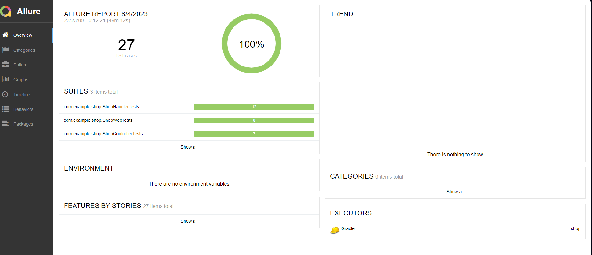
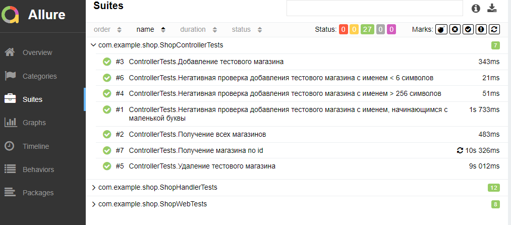
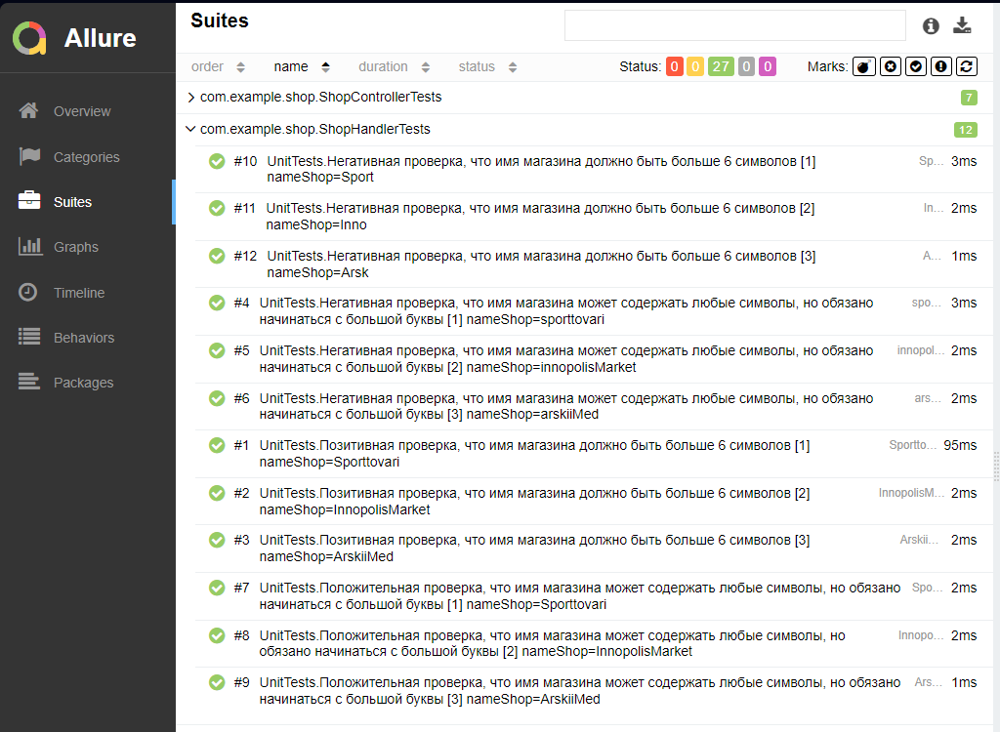
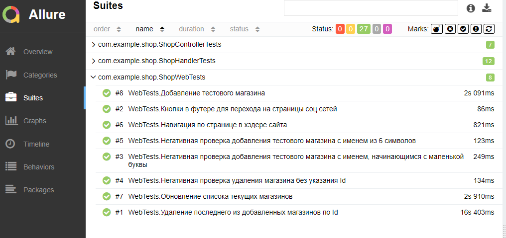

## Итоговая аттестация
Вам предстоит написать юнит, апи и е2е тесты для веб-приложения, которое выводит
список магазинов: https://github.com/npolyakova/shop.
### Технические особенности:
1. Чтобы развернуть приложение локально нужно:
- Форкнуть репозиторий
- Запустить приложение через класс ShopApplication
- Приложение запустится на порту 4000
 2. БД находится на удаленном сервере, подключение к ней осуществляется через
   hibernate. Напрямую в неё в тестах ходить не нужно.
 3. У всех продуктов бывают такие фичи, которые есть только в виде эндпоинта
   или только на стороне UI. Их также надо покрывать авто-тестами, как и весь
   остальной функционал. Найдите такие фичи в данном приложении и напишите
   на них тесты
   Важно:
   Подумайте, какие тесты и каких уровней нужно написать для максимально полного
   покрытия приложения. У вас должно быть не менее одного теста для каждого уровня.
   Помните о производительности ваших тестов: е2е для каждого негативного сценария
   проверки граничных значений инпута - это дорого. Изучите код, возможно, некоторые
   сценарии стоит проверять только на уровне юнит или апи тестов.
   Требования к приложению
### В приложении:
1. Должна быть возможность создавать магазины:
   a. Один запрос = один новый магазин
   b. Имя магазина должно быть больше 6 символов
   c. Имя магазина может содержать любые символы, но обязано начинаться
   с большой буквы
   d. Длина имени ограничена 256 символами
   e. При нарушении вышеперечисленных требований выводится
   соответствующая ошибка (к текстам ошибок требований нет, но ошибка
   должна быть обработана, то есть пользователю понятно, что пошло не
   так, а не просто 500 или 400, не важно на бэке или на фронте)
2. Должна быть возможность удалять магазины:
   a. Один запрос = один удаленный магазин
   b. При попытке удалить магазин без указания айди на фронтенде
   появляется соответствующая ошибка, на бэкенде не должно быть3. Должен быть запрос для вывода всех существующих магазинов, который
   выводит айди, название и настройку приватности магазина(публичный/не
   публичный)
4. Должен быть запрос для поиска, который ищет конкретный магазин по айди.
   Выводит результат, если айди существует, в виде айди, названия и настройки
   приватности магазина
5. Должна быть возможность обновлять список текущих магазинов с помощью
   специальной кнопки refresh, чтобы в случае обновления списка по api, можно
   было увидеть актуальный список магазинов
6. Должна быть навигация по странице в хэдере сайта
7. Должны быть кнопки в футере для перехода на страницы соц сетей
   Требования к сдаче задания
   Сдается ссылка на репозиторий с вашим проектом. В вашем проекте должны быть три
   вида тестов + настроен запуск тестов в github action (е2е и апи если не получается,
   оставьте только юниты) + прикручен allure testops для вывода результатов.

## Аллюр отчет

### 1. Тест 1 - ControllerTests

### 2. Тест 2 - UnitTests

### 3. Тест 3 - WebTests
